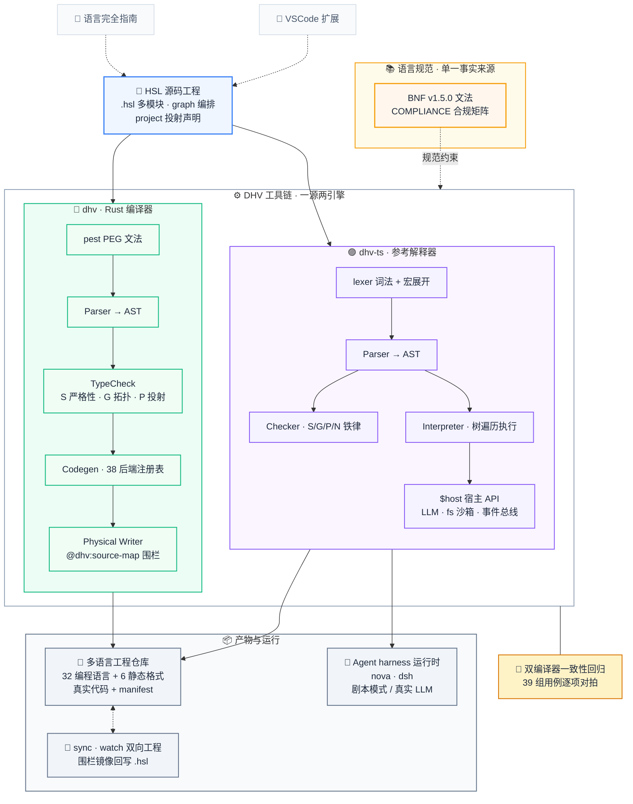

<div align="center">

# HSL — Harness Specification Language

**从逻辑到 38 个后端的工程投射 · 为编写 AI Agent harness 而生的编译型语言**

[](LICENSE)
[](toolchain/dhv/Cargo.toml)
[](toolchain/dhv-ts/package.json)
[](toolchain/hsl-spec/BNF.md)
[](toolchain/hsl-spec/BNF.md)
[](https://github.com/myh2026/harness-specification-language/actions/workflows/ci.yml)
[](https://github.com/myh2026/harness-specification-language/actions/workflows/quarter-tests.yml)
[](https://github.com/myh2026/harness-specification-language/actions/workflows/scheduled-tests.yml)

</div>

---

> **一句话定位**：你用一套带类型、带拓扑校验的源码描述 Agent 的逻辑与编排，
> DHV 工具链把它投射成一个真实的多语言工程仓库（Python / TypeScript / Rust / Go / … / YAML / Markdown），
> 而不是一个黑盒脚手架。

## ✨ 为什么是 HSL

现有的 Agent 框架回答的是「怎么跑起来」，HSL 回答的是「怎么把一个 Agent 系统描述成可靠的工程」。
它把四件通常散落在框架配置、运行时约定和代码注释里的东西，收进一门编译型语言：

- **编译期铁律，而不是运行时惊喜** —— S1–S8 严格性规则（零隐式转换、不可变优先、穷尽 match、未使用即错误……）
  在 `check` 阶段处决问题，这与把 bug 留到线上第 17 轮循环才爆炸是完全不同的工程体验；
- **编排即拓扑** —— `graph` 里 `node` 是物理依赖、`edge` 是带守卫的消息通道，编译器做 G1–G6 拓扑校验
  （无条件环、AgentLoop 穷尽性、边事件追踪），编排图不是画给人看的示意图，而是被验证过的程序结构；
- **产出是工程，不是黑盒** —— `project {}` 把同一份逻辑投射到 38 个后端
  （32 编程语言 + 6 静态格式）的真实源文件，生成物带 `@dhv:source-map` 围栏、可 `sync` 回写，
  人可以继续在生成代码上工作；
- **一源两引擎，结论互证** —— dhv（Rust 编译器）与 dhv-ts（参考解释器）对同一份语言规范做两套独立实现，
  一致性回归逐用例对拍两端的「通过/失败」结论，语言语义的模糊地带无处藏身。

## 👀 语言速览

节选自 [examples/nova](toolchain/examples/nova/README.md)（多 Agent 深度研究系统，2,000+ 行真实源码，有删减）：

```hsl
// ── 编排层：graph 是一等公民 —— node 是物理依赖，edge 是带守卫的消息通道 ──
graph Nova(question: String) -> Result<ResearchState, NovaError> {
    node brain: DeepSeekClient     = DeepSeekClient::new();
    node gate:  SafetyPolicy       = SafetyPolicy::default();
    node mut dispatcher: Vec<Task> = Vec::new();

    edge brain      -> dispatcher on NovaEdge::TaskReady;
    edge dispatcher -> gate       on NovaEdge::FindingReady;
    edge gate       -> brain      on NovaEdge::VerdictReady with backpressure = true;

    loop {                                          // AgentLoop（G1 拓扑校验）
        let planned = Planner::run(state.clone())?; // `?` 传播 + From 自动转换
        let next = state.clone().next_ready();
        match next {                                // S6：穷尽 match
            Some(task) => dispatcher.push(task),
            None       => break,
        }
    }
}

// ── 投射层：同一份逻辑，声明式铺进真实工程的多语言文件 ──
project {
    Nova -> "src/main.rs" : rust,
    rules {                                   // BNF v1.5 规则组：{name} 占位符
        struct -> "src/types/{name}.rs"  : rust,
        fn     -> "src/logic/{name}.rs"  : rust,
        block  -> "config/{name}.yml"    : yaml,
    }
}
```

## 🏗️ 架构总览



怎么读这张图：**绿色管线管「产物」，紫色管线管「现在就能跑」**。要跨语言工程仓库，走 dhv 静态投射；
要在本机直接执行 Agent harness（含接真实 LLM），走 dhv-ts 解释执行；两者读同一份 BNF 规范，
由一致性回归保证结论互证。类比：**dhv 之于 dhv-ts，如同 GCC 之于 CPython**。

| | dhv（Rust） | dhv-ts（TypeScript） |
|:---|:---|:---|
| 定位 | 生产编译器 | 参考解释器 + 开发运行时 + 38 后端投射器 |
| 执行方式 | 静态投射到 38 后端 | 逐 AST 解释执行 + emit 多目标生成 |
| 类型检查 | 全量（S/P/G 规则 + 类型推导） | 结构级铁律（S1/S2/S4/S6/S7/S8 + G/P/N 子集） |
| `native` 块 | 按目标语言生成胶水 | **运行期真实执行**（TypeScript 进程内 / Python 子进程） |
| 标准库 | std 方法面 | 10 模块（core/collections/text/math/io/json/time/random/env/iter） |
| 双向工程 | watch（源文件） | sync 围栏回写 + watch（`@dhv:hsl-mirror` 三标记协议） |
| 依赖 | Rust 工具链 | Bun（零第三方依赖；LLM 网关经 z-ai-web-dev-sdk） |

## 📂 目录结构

```
HSL/
├── toolchain/     # DHV 工具链（主产品）
│   ├── dhv/       #   Rust 编译器（PEG 文法 hsl.pest，多后端转译）
│   ├── dhv-ts/    #   TypeScript 参考解释器（check / run / emit / targets / sync / watch）
│   ├── examples/  #   内置示例：nova（研究型 Agent）、dsh（对话型 Agent）、backends-demo（38 后端投射）
│   ├── hsl-spec/  #   BNF v1.5.0 语言规范 + 合规矩阵
│   └── tests/     #   双编译器一致性回归套件（run_conformance.sh）
├── guide/         # HSL 语言完全指南（4000+ 行，全部示例经实测）
└── ide/           # VSCode 扩展（语法高亮 / 片段 / 主题）
```

## ⚡ 快速开始

依赖：Rust 工具链（构建 dhv 用）+ [Bun](https://bun.sh)（运行 dhv-ts 用，零第三方依赖）。

```bash
# 0) 克隆
git clone https://github.com/myh2026/harness-specification-language.git
cd harness-specification-language/toolchain

# 1) 构建 Rust 编译器
cd dhv && cargo build --release && cd ..

# 2) 静态校验示例（dhv 与 dhv-ts 双端一致）
./dhv/target/release/dhv check examples/nova/nova.hsl
bun dhv-ts/src/main.ts check examples/nova/nova.hsl

# 3) 真实运行一个 Agent harness（scripted 剧本模式，确定性、可复现）
cp -r examples/dsh/workspace /tmp/dsh-ws
bun dhv-ts/src/main.ts run examples/dsh/dsh.hsl \
  --workspace /tmp/dsh-ws \
  --task "stats.ts 中 variance() 的分母用错了（应为样本方差 n-1），且 median() 尚未实现。请修复并让 stats.test.ts 全部通过。" \
  --model scripted \
  --fixture examples/dsh/fixtures/fix-variance.json \
  --out /tmp/dsh-run

# 4) 投射出真实工程（38 后端 + manifest + 语法校验）
bun dhv-ts/src/main.ts emit examples/backends-demo/agent.hsl --out /tmp/backends-demo

# 5) 双编译器一致性回归（示例 + parse/check/errors/modules 矩阵 + 值级/emit 对拍）
bash tests/run_conformance.sh
```

只想看产物、不想装 Rust？第 2/3/4 步仅用 Bun 即可完成；`bun dhv-ts/src/main.ts targets`
可列出全部 38 个后端（tier / 能力级 / 扩展名）。

## 🌟 新语法（BNF v1.5）：投射规则组 `rules {}`

不再逐项手写 `A -> path : lang` 映射 —— 按项类型批量投射，显式映射优先（R1 遮蔽原则）：

```hsl
project {
    Nova -> "src/main.rs" : rust,          // 显式映射（优先于规则）

    rules {                                 // v1.5 规则组：{name} 占位符
        struct -> "src/types/{name}.rs"  : rust,
        enum   -> "src/types/{name}.rs"  : rust,
        fn     -> "src/logic/{name}.rs"  : rust,
        graph  -> "src/graphs/{name}.rs" : rust,
        block  -> "config/{name}.yml"    : yaml,
    }
}
```

规则声明校验：占位符白名单（R2）· 类型唯一（R3）· 类型注册（R4）；
展开池覆盖依赖模块导出项（R5）；展开项与显式项同等参与 P2/P4 校验（R6）。详见 [BNF §3.4](toolchain/hsl-spec/BNF.md)。

## 🧪 测试矩阵

| 套件 | 覆盖 |
|:---|:---|
| `dhv/tests/conformance.rs`（cargo test） | parse / check / errors（S4·S6·S7·S8·P4·P5·M2）/ 多模块 linker / 值语境 range（dhv 独有） |
| `toolchain/tests/run_conformance.sh` | **双编译器一致性**：dhv ↔ dhv-ts「通过/失败」结论逐一对照，含值级与 emit 行为级对拍 |
| `dhv/tests/grammar_probe.rs` | pest 文法探针（raw string） |

回归原则：**修复一个 bug，就锁定一个用例。**

测试节奏双车道，均失败自动开 Issue 跟踪、恢复全绿自动关闭，均可手动触发（Actions → 对应工作流 → Run workflow）：

- **[Quarter Tests](.github/workflows/quarter-tests.yml)（每 15 分钟快车道）**：实装工具链（cargo build --release + dhv 二进制冒烟）→ 3 个项目（nova 静态检查 / dsh 剧本端到端 / backends-demo 投射）→ 38 后端全测（[tests/verify_backends.ts](toolchain/tests/verify_backends.ts)：全文件语法校验 + 零告警 + 注册表 38 后端 ↔ 产物语言集合双向全覆盖 + 静态 json 内容级真解析）；
- **[Scheduled Tests](.github/workflows/scheduled-tests.yml)（每日 UTC 20:30 / 北京 04:30 全量深水区）**：dhv-ts 全量套件（111 用例）+ 示例回归 + IDE 校验 + cargo test + 双编译器一致性。

## 📦 版本化发布

预编译二进制随 [GitHub Releases](https://github.com/myh2026/harness-specification-language/releases) 分发：

| 平台 | 架构 | 产物 |
|:---|:---|:---|
| Linux | x86_64 (gnu) | `dhv-v{VER}-linux-x86_64.tar.gz` |
| macOS | arm64 (Apple Silicon) | `dhv-v{VER}-macos-aarch64.tar.gz` |
| Windows | x86_64 | `dhv-v{VER}-windows-x86_64.zip` |

## 🛡️ 当前版本

**dhv 0.2.52 · dhv-ts 0.2.56 · BNF v1.5.0 · 指南 v0.2.51 · IDE v0.1.1**

- 版本号以 `toolchain/dhv/Cargo.toml` 与 `toolchain/dhv-ts/package.json` 为准，随每次功能/修复递增；
- 详见 [CHANGELOG.md](CHANGELOG.md)。

## 🗺️ 文档导航

| 想了解… | 去这里 |
|:---|:---|
| 语言怎么写（教程级，示例全部实测） | [guide/HSL-GUIDE.md](guide/HSL-GUIDE.md) |
| 语法的正式定义 | [toolchain/hsl-spec/BNF.md](toolchain/hsl-spec/BNF.md) |
| 两套实现各自覆盖到什么程度 | [toolchain/hsl-spec/COMPLIANCE.md](toolchain/hsl-spec/COMPLIANCE.md) |
| Rust 编译器内部结构与路线图 | [toolchain/dhv/README.md](toolchain/dhv/README.md) |
| 解释器运行方式 / native 逃生舱 / 已知限制 | [toolchain/dhv-ts/README.md](toolchain/dhv-ts/README.md) |
| 三个可直接跑的完整项目 | [toolchain/examples/](toolchain/examples/)（nova · dsh · backends-demo） |
| 每个 HSL 文件怎么变成多语言仓库 | [toolchain/examples/backends-demo/agent.hsl](toolchain/examples/backends-demo/agent.hsl) |

## 📄 许可证

MIT — 见 [LICENSE](LICENSE)（toolchain / guide / ide 各目录亦持有同许可副本）。
